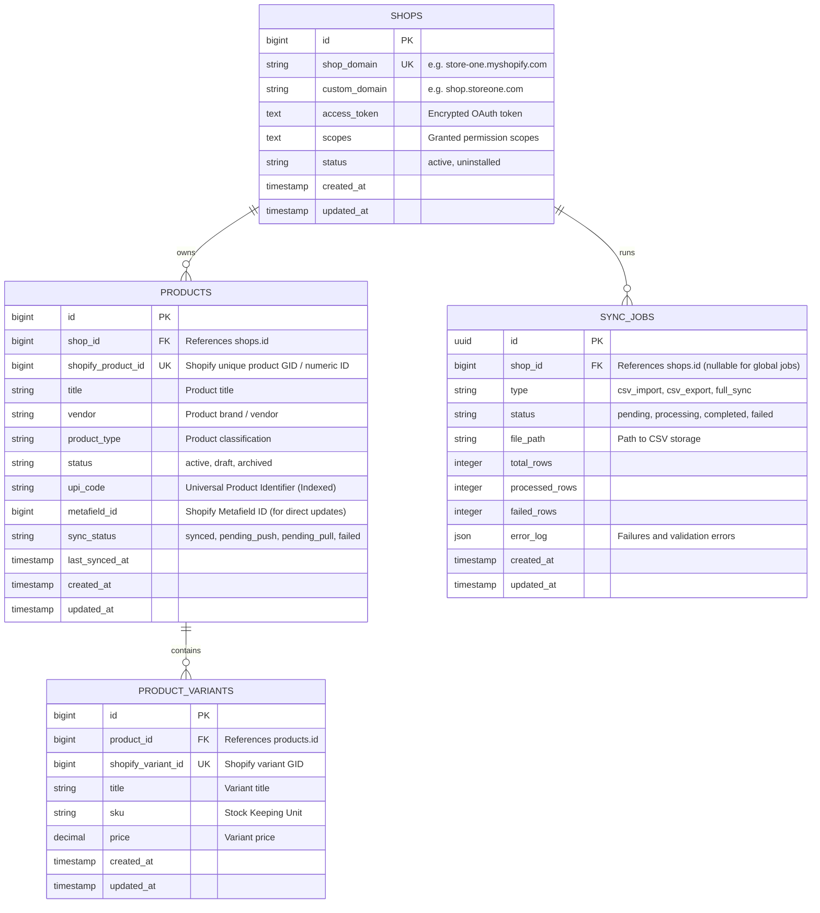
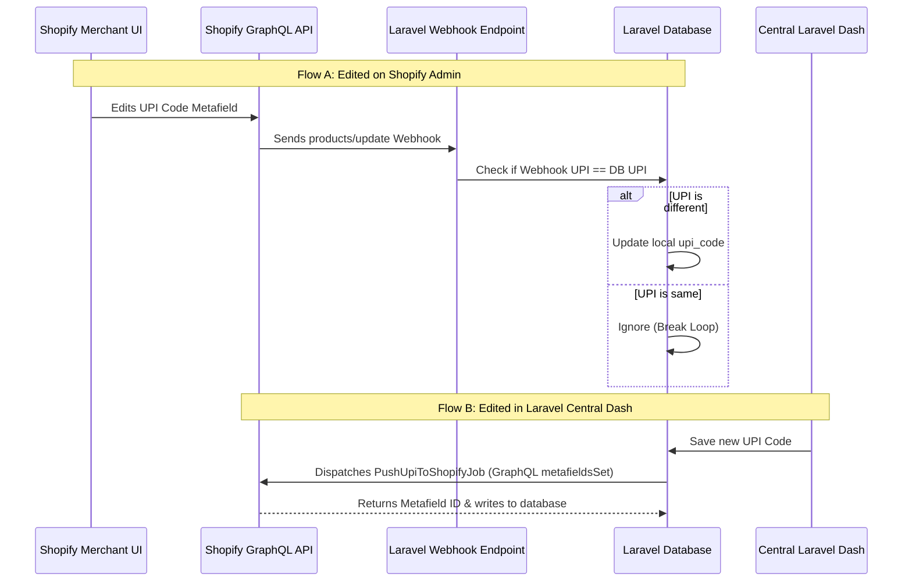
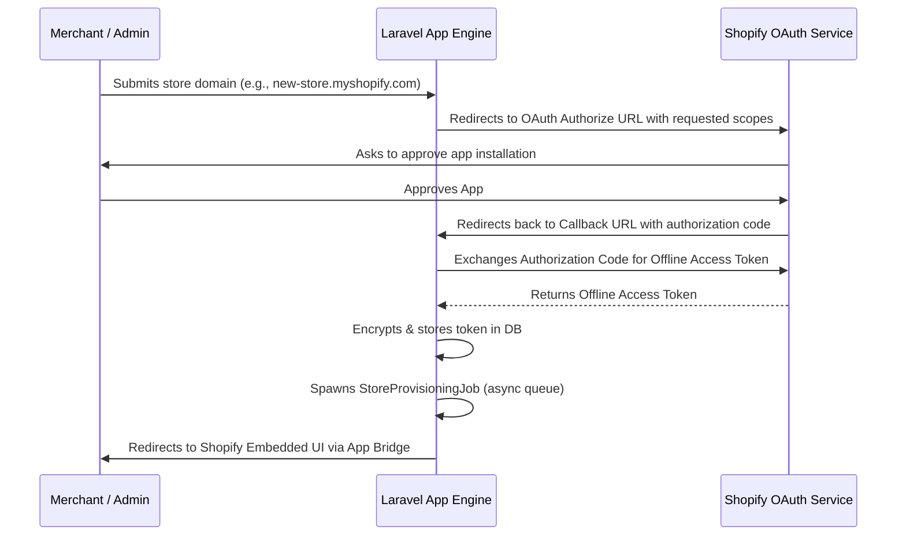

# Centralized Shopify UPI Code Management System
## Architecture & System Design Document

This document provides a production-grade architecture design for a Shopify Embedded App built with **Laravel 12**, **PHP 8.3**, and **MySQL**. The system is designed to manage unique product identifiers (UPI Codes) across **27+ Shopify stores** (scalable to 100+ stores, representing millions of products) with bidirectional sync, central management, and fast onboarding.

---

## 1. High-Level System Architecture

The application acts as a single, centralized multi-tenant control plane. It uses **Shopify App Bridge** and **Polaris UI** inside the Shopify Admin frame for merchant-facing settings, and a secure centralized dashboard for global operations (bulk import/export, cross-store searching, filtering).

```mermaid
graph TD
    subgraph Shopify Ecosystem
        StoreA[Shopify Store 1]
        StoreB[Shopify Store 2]
        StoreN[Shopify Store N]
    end

    subgraph Laravel central Engine (Multi-Tenant)
        AppBridge[App Bridge / Polaris Frontend]
        API[Laravel API Controllers]
        Queue[Laravel Horizon / Redis Queues]
        WebhookHandler[Webhook Ingestion Engine]
    end

    subgraph Data & Storage
        DB[(MySQL Database)]
        Cache[(Redis Cache & Throttle)]
    end

    StoreA <-->|OAuth / GraphQL / Webhooks| WebhookHandler
    StoreB <-->|OAuth / GraphQL / Webhooks| WebhookHandler
    StoreN <-->|OAuth / GraphQL / Webhooks| WebhookHandler
    
    WebhookHandler --> Queue
    Queue --> API
    API --> DB
    API --> Cache
    AppBridge <--> API
```

---

## 2. Database Schema & ER Diagram

To support centralized searching and filtering across 100+ stores while maintaining optimal read/write speeds, we utilize a single MySQL database. Multi-tenancy is enforced at the database layer via composite indexing and query scoping.

### ER Diagram



### Table DDL Structure

#### `shops` Table
Stores the Shopify connection details.
```sql
CREATE TABLE `shops` (
  `id` BIGINT UNSIGNED AUTO_INCREMENT PRIMARY KEY,
  `shop_domain` VARCHAR(255) NOT NULL UNIQUE,
  `custom_domain` VARCHAR(255) NULL,
  `access_token` TEXT NOT NULL, -- Encrypted using Laravel's cast
  `scopes` TEXT NOT NULL,
  `status` VARCHAR(50) NOT NULL DEFAULT 'active', -- active, uninstalled
  `created_at` TIMESTAMP NULL,
  `updated_at` TIMESTAMP NULL,
  INDEX `idx_shops_status` (`status`)
) ENGINE=InnoDB DEFAULT CHARSET=utf8mb4 COLLATE=utf8mb4_unicode_ci;
```

#### `products` Table
Stores product details synced from Shopify. Optimized for cross-store search and filtering.
```sql
CREATE TABLE `products` (
  `id` BIGINT UNSIGNED AUTO_INCREMENT PRIMARY KEY,
  `shop_id` BIGINT UNSIGNED NOT NULL,
  `shopify_product_id` BIGINT UNSIGNED NOT NULL UNIQUE,
  `title` VARCHAR(255) NOT NULL,
  `vendor` VARCHAR(255) NOT NULL,
  `product_type` VARCHAR(255) NOT NULL,
  `status` VARCHAR(50) NOT NULL DEFAULT 'active', -- active, draft, archived
  `upi_code` VARCHAR(100) NULL,
  `metafield_id` BIGINT UNSIGNED NULL,
  `sync_status` VARCHAR(50) NOT NULL DEFAULT 'synced', -- synced, pending_push, pending_pull, failed
  `last_synced_at` TIMESTAMP NULL,
  `created_at` TIMESTAMP NULL,
  `updated_at` TIMESTAMP NULL,
  FOREIGN KEY (`shop_id`) REFERENCES `shops` (`id`) ON DELETE CASCADE,
  -- Optimized indexes for searching and filtering
  INDEX `idx_products_upi` (`upi_code`),
  INDEX `idx_products_filter` (`shop_id`, `vendor`, `product_type`, `status`),
  FULLTEXT INDEX `idx_products_title_search` (`title`)
) ENGINE=InnoDB DEFAULT CHARSET=utf8mb4 COLLATE=utf8mb4_unicode_ci;
```

#### `product_variants` Table
Allows future extension if UPI codes need to shift to variant levels.
```sql
CREATE TABLE `product_variants` (
  `id` BIGINT UNSIGNED AUTO_INCREMENT PRIMARY KEY,
  `product_id` BIGINT UNSIGNED NOT NULL,
  `shopify_variant_id` BIGINT UNSIGNED NOT NULL UNIQUE,
  `title` VARCHAR(255) NOT NULL,
  `sku` VARCHAR(100) NULL,
  `price` DECIMAL(10,2) NOT NULL DEFAULT 0.00,
  `created_at` TIMESTAMP NULL,
  `updated_at` TIMESTAMP NULL,
  FOREIGN KEY (`product_id`) REFERENCES `products` (`id`) ON DELETE CASCADE
) ENGINE=InnoDB DEFAULT CHARSET=utf8mb4 COLLATE=utf8mb4_unicode_ci;
```

#### `sync_jobs` Table
Tracks long-running CSV import/export tasks.
```sql
CREATE TABLE `sync_jobs` (
  `id` CHAR(36) NOT NULL PRIMARY KEY, -- UUID
  `shop_id` BIGINT UNSIGNED NULL,
  `type` VARCHAR(50) NOT NULL, -- csv_import, csv_export, full_sync
  `status` VARCHAR(50) NOT NULL DEFAULT 'pending',
  `file_path` VARCHAR(255) NULL,
  `total_rows` INT UNSIGNED DEFAULT 0,
  `processed_rows` INT UNSIGNED DEFAULT 0,
  `failed_rows` INT UNSIGNED DEFAULT 0,
  `error_log` JSON NULL,
  `created_at` TIMESTAMP NULL,
  `updated_at` TIMESTAMP NULL,
  FOREIGN KEY (`shop_id`) REFERENCES `shops` (`id`) ON DELETE SET NULL
) ENGINE=InnoDB DEFAULT CHARSET=utf8mb4 COLLATE=utf8mb4_unicode_ci;
```

---

## 3. Shopify Metafield Strategy

To make the UPI Code editable inside both the centralized Laravel dashboard and the Shopify Product Admin, we leverage Shopify **Metafields**.

### Configuration Parameters
- **Namespace**: `upi_manager`
- **Key**: `code`
- **Type**: `single_line_text_field`
- **Owner Type**: `Product`

### Programmatic Definition Registration
During OAuth installation, the app registers a **Metafield Definition** on Shopify. This enables Shopify's native Admin UI to show a human-readable text box for the UPI code under the product edit page.

#### GraphQL Mutation:
```graphql
mutation CreateMetafieldDefinition($definition: MetafieldDefinitionInput!) {
  metafieldDefinitionCreate(definition: $definition) {
    createdDefinition {
      id
      name
      namespace
      key
    }
    userErrors {
      field
      message
    }
  }
}
```
**Variables**:
```json
{
  "definition": {
    "name": "UPI Code",
    "namespace": "upi_manager",
    "key": "code",
    "type": "single_line_text_field",
    "ownerType": "PRODUCT",
    "description": "Unique Universal Product Identifier managed by Centralized UPI Dashboard."
  }
}
```

### Sync Flow Engine (Bidirectional & Loop Prevention)

To prevent infinite loops (e.g., Shopify triggers a webhook -> Laravel updates database -> Laravel updates Shopify metafield -> Shopify triggers webhook again), we use an **idempotency & state comparison strategy**:



---

## 4. OAuth Flow & Multi-Store Connection

To connect a new store in **under 2 minutes**, the app must handle OAuth seamlessly and execute provisioning automatically in the background.



### Automatic Provisioning Tasks (`StoreProvisioningJob`)
Once the token is acquired, the background job immediately performs:
1. **Webhook Subscriptions**: Subscribes to `products/create`, `products/update`, `products/delete`, and `app/uninstalled`.
2. **Metafield Definition Creation**: Registers the `upi_manager.code` definition.
3. **Catalog Synchronization**: Triggers a Shopify Bulk Query to pull all existing products and their metafields.

---

## 5. Webhook Strategy

Webhooks keep the centralized Laravel app in sync with merchant actions on Shopify.

### Webhook Subscriptions

| Topic | Event | Handler Job | Payload Action |
|---|---|---|---|
| `products/create` | New product created | `ProcessProductCreateWebhook` | Inserts product into DB with null/default UPI. |
| `products/update` | Product edited (including metafields) | `ProcessProductUpdateWebhook` | Compares fields/metafield and syncs changes. |
| `products/delete` | Product deleted from Shopify | `ProcessProductDeleteWebhook` | Hard/Soft deletes product from MySQL. |
| `app/uninstalled` | App removed from a store | `ProcessAppUninstallWebhook` | Marks store status as `uninstalled` and revokes token. |

### Webhook Handling Pipeline

1. **Ingestion Endpoint**: A lightweight route `/api/webhooks` receives the payload.
2. **Verification**: Middleware verifies the `X-Shopify-Hmac-Sha256` header against the Shopify Client Secret.
3. **Queue Dispatch**: The payload is pushed directly to the Redis queue (`high-priority` queue) within milliseconds to prevent timeouts (Shopify requires a `200 OK` response within 5 seconds).
4. **Idempotency Check**: The queue worker processes the job and validates the webhook payload's `updated_at` timestamp against the database's `updated_at` to discard out-of-order events.

---

## 6. Queue Architecture (Laravel Horizon)

The application utilizes **Redis** for queue management, monitored by **Laravel Horizon**. This ensures high throughput and granular control over Shopify's API rate limits.

```
                   ┌───────────────┐
                   │  Redis Queue  │
                   └───────┬───────┘
                           │
         ┌─────────────────┼─────────────────┐
         ▼                 ▼                 ▼
 ┌──────────────┐  ┌──────────────┐  ┌──────────────┐
 │ webhook-sync │  │  bulk-import │  │  default     │
 └──────┬───────┘  └──────┬───────┘  └──────┬───────┘
        │                 │                 │
        ▼                 ▼                 ▼
 60 Workers        5 Workers         10 Workers
 (High Priority)   (Low Priority)    (API Outbound)
```

### Jobs Definition

1. **`SyncProductJob`**: Handles incoming product webhook payloads.
2. **`PushUpiToShopifyJob`**: Pushes a UPI code updated inside the Laravel Dashboard back to Shopify using the GraphQL `metafieldsSet` mutation.
3. **`BulkImportCsvJob`**: Parses uploaded CSV files in chunks, updates local products, and queues up batch pushes to Shopify.
4. **`BulkExportCsvJob`**: Compiles cross-store product lists with UPI codes and generates a downloadable CSV.
5. **`RegisterShopifyWebhookJob`**: Ensures webhook subscriptions are registered correctly.

### Shopify GraphQL API Rate Limit Throttling
Shopify's GraphQL API uses a **Leaky Bucket** algorithm measured in *cost points* (typically a restore rate of 50-100 points/second).

We implement rate-limiting via **Laravel's Redis Rate Limiter**:
```php
use Illuminate\Support\Facades\Redis;

public function handle()
{
    // Restrict requests to this Shopify store to respect API rate limits
    Redis::throttle("shopify-api:{$this->shop->id}")
        ->allow(40) // Allow 40 API calls
        ->every(1)  // Every 1 second
        ->then(function () {
            $this->executeShopifyMutation();
        }, function () {
            // Could not obtain lock, release back to queue with delay
            return $this->release(5);
        });
}
```
For Shopify Bulk Operations (importing/syncing), we run a single GraphQL request using Shopify's asynchronous Bulk Operations API rather than querying thousands of pages.

---

## 7. Security Considerations

1. **Token Security (Encryption at Rest)**:
   Access tokens are encrypted in the database. In Laravel 12, this is handled via Model Casts:
   ```php
   protected function casts(): array
   {
       return [
           'access_token' => 'encrypted',
       ];
   }
   ```
2. **Shopify App Bridge Session Token Verification**:
   The embedded frontend uses App Bridge to generate a temporary JSON Web Token (JWT). The Laravel backend validates this token signature against the Shopify Client Secret on every request, rendering the app immune to cookie-based CSRF attacks.
3. **SQL Injection & XSS Guardrails**:
   - Eloquent Query Builder is utilized for parameterized queries.
   - Blade and frontend reactive views automatically sanitize outputs.
4. **Tenant Isolation**:
   Every database query inside the Shopify admin portal uses a global query scope limiting queries to the active shop:
   ```php
   static::addGlobalScope('shop', function (Builder $builder) {
       $builder->where('shop_id', Auth::user()->shop_id);
   });
   ```

---

## 8. Scalability Plan for 100+ Stores (Millions of Products)

Managing 100+ stores requires decoupling heavy sync logic from user-facing transactions.

### Database Scaling
1. **Indexes**: Composite index on `(shop_id, upi_code)` and `(shop_id, status)` prevents table scans.
2. **Read/Write Splitting**: Route UI reads to a replica DB instance while write transactions (syncs, CSV uploads) execute on the primary MySQL instance.
3. **Partitioning**: If product count exceeds 20 million, partition the `products` table by `shop_id` range.

### Cross-Store Search Optimization
Using standard `LIKE '%query%'` queries will slow down as table size increases.
- **Search Engine Integration**: Sync the `products` table with an **Elasticsearch** cluster or **Algolia** index using Laravel Scout.
- Search queries from the dashboard execute directly against Elasticsearch, returning matching product and shop IDs in milliseconds.

### Initial Catalog Import (Bulk Operations)
To pull product catalogs of 100+ stores without hitting rate limits, avoid paginated `products` queries. Use the **Shopify Bulk Query API**, which writes the entire catalog to a JSONL file on Shopify's servers and provides a URL to download it asynchronously.

#### Request Bulk Sync:
```graphql
mutation {
  bulkOperationRunQuery(
   query: """
    {
      products {
        edges {
          node {
            id
            title
            vendor
            productType
            status
            metafield(namespace: "upi_manager", key: "code") {
              id
              value
            }
          }
        }
      }
    }
   """
  ) {
    bulkOperation {
      id
      status
    }
    userErrors {
      field
      message
    }
  }
}
```
Laravel's queue polls the status of the bulk job. Once ready, it retrieves the JSONL file, reads it line-by-line using a generator (to keep memory footprint minimal), and updates MySQL in batches.

---

## 9. Bulk CSV Import / Export Architecture

### Bulk Import CSV Flow (Upload to Database to Shopify)
1. **Chunking**: The CSV file is uploaded to secure private storage (S3).
2. **Queueing**: A `BulkImportCsvJob` is created.
3. **Processing**: The CSV is processed in chunks of 500 rows using PHP's `fgetcsv`.
4. **Database Write**: The database updates the UPI codes and marks `sync_status = 'pending_push'`.
5. **Shopify Batch Push**:
   Instead of updating one metafield at a time, we batch them up. The Laravel queue utilizes Shopify's `metafieldsSet` mutation which accepts an array of up to 25 metafields at once, significantly reducing the API cost.

### Bulk Export CSV Flow
1. **Query**: A query retrieves products based on selected dashboard filters.
2. **Streaming**: Laravel's `StreamedResponse` streams the database rows directly to S3 as a CSV to prevent PHP memory exhaustion.
3. **Delivery**: The system notifies the user via an in-app toast notifications or email with a signed download URL.
